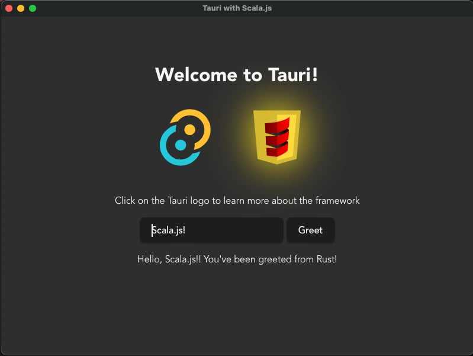

# Tauri + Scala.js
This is a port of tauri with vanilla javascript demo to scala.js. Most of DOM elements in index.html has been moved to scalatags and commented out. `src/main.js` is not needed to run but included to compare logic.

### Run
1. git clone https://github.com/nineclue/sjs-tauri-demo.git
1. cd sjs-tauri-demo
1. npm install
1. sbt fastCopy
1. npm run tauri dev

